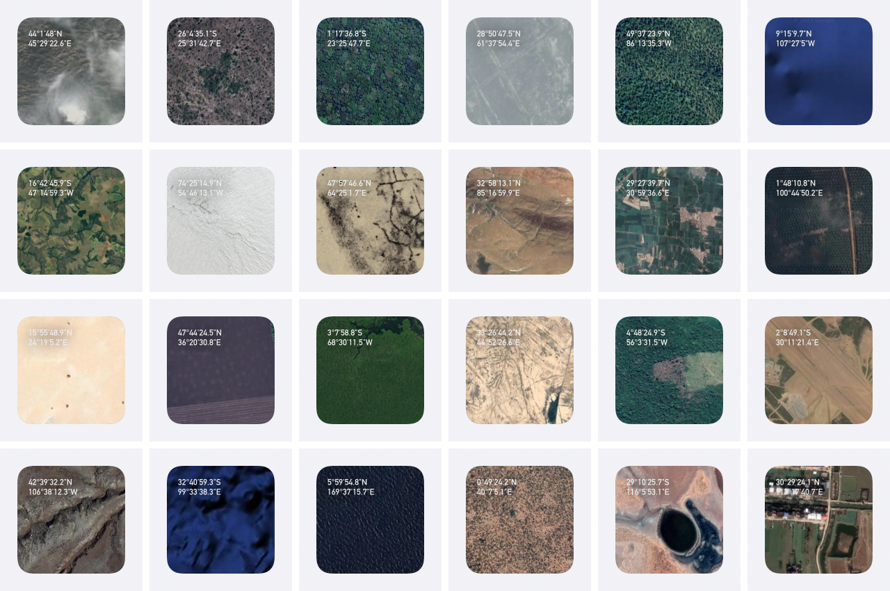

# aerialbot-lite

*Scriptable widget that shows a random location in the world.*

**Why?**
Because [after](https://twitter.com/doersino/status/1418647087449784330) discovering [Scriptable](https://scriptable.app) and its JavaScript-powered widgets, I decided to try and get to know it by reimplementing something I've built previously – which ended up being [ærialbot](https://github.com/doersino/aerialbot), a Twitter bot that regularly posts satellite imagery of random locations in the world. This widget accordingly downloads a random map tile from Google Maps and displays it along with its latitude and longitude.

**Show me!**
Sure thing – here's a bunch of randomly selected screenshots of the widget in action.

**Any setup required?**
Not more than for any other Scriptable widget! Download `aerialbot-lite.js` and place it in the "Scriptable" directory in your iCloud Drive (or copy the source code into a new Scriptable script). Optionally, take a look at the options near the top of the source code. Then, back on your homescreen, [go into jiggle mode](https://www.youtube.com/watch?v=pAOjDXdiUzM) and create a new Scriptable widget of your preferred size. Tap it to assign the relevant script to it, then wait a few seconds for it to complete its first update.

**How's it work?**
Each time the script runs, it generates a random location, picks a random zoom level, computes the relevant map tile coordinates, downloads the map tile from Google Maps, and displays it. (Background: Each map tile is 256×256 pixels; zoom level 0 shows the whole planet within those pixels; and for tighter zoom levels, the displayed area is recursively divided into four quadrants.)

* Note that the script is designed to power small widgets only – wide or large ones work *technically* fine, but things will look *really* blurry.
* Also note that this script directly accesses map tiles that are really supposed to be accessed through an API (more at the bottom of [this](https://github.com/doersino/scriptable-widgets/tree/main/location-location-location) document), so it could break at any point.
* You also need to keep the map tile version up to date, see the code for more – that'll require manual intervention only about once a year or so. (For simplicity's sake, I decided againt determining it automatically.)
